# Metro Survival

> ## 목차
- [목차](#목차)
- [게임 소개](#게임-소개)
- [세계관(배경)](#세계관배경)
- [게임 컨셉](#게임-컨셉)
- [캐릭터 소개](#캐릭터-소개)
    - [플레이어](#플레이어)
        - [조작방법](#조작-방법)
    - [적](#적)
    - [NPC](#npc)
- [게임 시스템 디자인](#게임-시스템-디자인)
    - [아이템](#아이템)
    - [행동 분석](#행동-분석)
    - [파라미터 분석](#파라미터-분석)
    - [상태 분석](#상태-분석)
    - [게임 규칙](#게임-규칙)
- [개발 요구사항&흐름도](#개발-요구사항흐름도)
    - [개발 요구사항](#개발-요구사항)
        - [구현 완료](#구현-완료)
    - [키보드 이벤트 흐름도](#키보드-이벤트-흐름도)
- [개발 작업 일정](#개발-작업-일정)
- [주차별 개발 내용](#주차별-개발-내용)
    - [1주차](#1주차)
    - [2주차](#2주차)
    - [3주차](#3주차)
    - [4주차](#4주차)
    - [5주차](#5주차)
    - [6주차](#6주차)
    - [7주차](#7주차)

   

> #  **게임 소개**
***

본 게임은 유니티를 활용하여 도트 그래픽을 기반으로 한 탑뷰 형식의 로그라이크의 2D게임이다.

플레이어는 캐릭터를 조작하며 마주치는 적을 물리치고 NPC와 상호작용을 하며 생존을 거듭해 나간다.

캐쥬얼한 그래픽과 그에 상반되는 어두운 세계관을 갖는 특징이 있다.

  

> # **세계관(배경)**
***
 

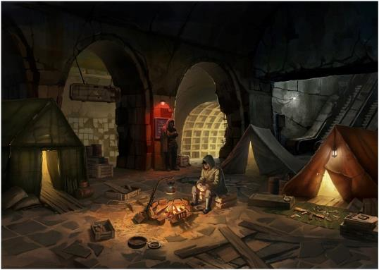

 

핵 전쟁으로 인해 지상에서 생활은 어려워졌다. 핵으로 인한 오염 구역이 퍼지기 시작하여 지상에서 생활은 어려워지기 시작하고 남은 생존자들은 지하철로 도망갔다.

하지만 지하철도의 모든 구역이 안전한 장소가 아니었으며, 오염이 시작된 장소가 생기면서 이로 인한 돌연변이 생물이 나타나기 시작한다.

주인공은 이러한 상황 속에서 살아남기 위해 싸우고 다른 인물과 거래를 하며 생존한다.

  

> # **게임 컨셉**

 

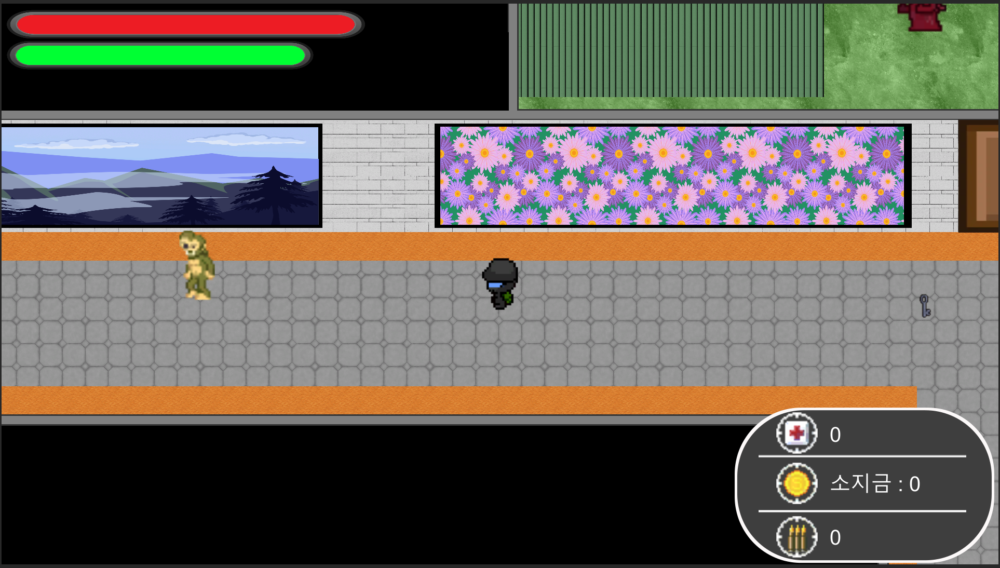

 

## **2D 로그라이크 게임**

**2D 도트** 게임으로 **탑뷰** 형식의 게임이며 **로그라이크** 스타일의 게임이다. 게임의 배경이 되는 지하철에서 플레이어는 여러 곳을 돌아다니며 한정된 자원으로 최대한 오래 살아남는 생존을 목표로 플레이하게 된다.

 

## **생존**

본 게임은 플레이어가 지하철에서 다가오는 적의 공격을 피하고 처치하며 위험한 오염 구역에 아무런 대비 없이 들어가면 체력이 감소하는 등 모든 플레이 중에는 **생존**을 염두에 두며 플레이를 해야한다.

 

## **한정된 자원**

기본 무기는 단검과 권총만 갖고 있어 적의 공격에 주의를 하며 원거리 무기는 멀리서 적을 공격할 수 있지만 **한정된 자원**의 문제로 사용해야 할 시기를 생각해서 사용해야 한다.

  

> # **캐릭터 소개**

***

## 플레이어

 
 
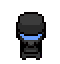
 
 

### 조작 방법

 

 |입력키|설명|
 |:---:|:---:|
 |WASD|각 방향으로 입력시 플레이어가 해당 방향으로 이동한다.|
 |좌클릭|현재 플레이어가 바라보고 있는 방향으로 근접 공격을 실행한다.|
 |우클릭|마우스 포인터가 위치한 방향으로 원거리 공격을 실행한다.|
 |Space 바|플레이어가 구르면서 공격을 회피한다.|
 |H|현재 메디킷을 보유하고 있으면 메디킷을 소모해 체력을 회복한다.|
 |I|인벤토리를 열고 닫을 수 있다.|
 |F|상점을 열 수 있다.|
 |Z|상점을 닫을 수 있다.|

 

## 적

  

 

 |적 종류|이미지|설명|
 |:---:|:---:|:---:|
 |근접 적|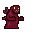|플레이어가 일정 거리 내에 위치할 경우 근접 공격을 하는 적|
 |근접 적 바리에이션|후에 이미지 첨부|플레이어가 일정 거리 내에 위치할 경우 근접 공격을 하는 적, 원래 적보다 기본 능력이 더 높다.|
 |원거리 적|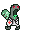|플레이어를 인식한 후 일정 거리 내에 위치할 경우 원거리 공격을 하고 너무 가까우면 뒤로 물러나는 적|
 |원거리 적 바리에이션|후에 이미지 첨부|플레이어를 인식한 후 일정 거리 내에 위치할 경우 원거리 공격을 하고 너무 가까우면 뒤로 물러나는 적, 원래 적보다 기본 능력이 더 높다.|

 

### 정예 적

 

 |적 종류|이미지|설명|
 |:---:|:---:|:---:|
 |근접 정예 적|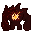|일반 적보다 기본 능력이 높으며 근접 공격만 하는 정예 적|
 |근접, 원거리 정예 적|후에 이미지 첨부|일반 적보다 기본 능력이 높으며 상황에 따른 근접, 원거리 공격을 하는 정예 적|

 

## NPC

 

 |NPC 종류|이미지|설명|
 |:---:|:---:|:---:|
 |무기 상인|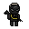|안전지대에 위치해 있으며 플레이어에게 무기 등을 판매한다.|
 |의사|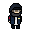|안전지대에 있으며 체력 회복, 방사능 오염 수치 하락 등 상호작용 가능|

  

> # **게임 시스템 디자인**

 

 ## 아이템
 
  

 |이미지|이름|종류|설명|비고|
 |:---:|:---:|:---:|:---:|:---:|
 ||단검|근접 무기|근접한 적을 공격 가능한 무기|기본 지급, 짧은 사거리, 빠른 공격속도, 약간 낮은 대미지|
 |후에 이미지 첨부|도끼|근접 무기|근접한 적을 공격 가능한 무기|드랍 또는 특수 획득 가능, 중간 사거리, 낮은 공격 속도, 높은 대미지|
 |후에 이미지 첨부|방망이|근접 무기|근접한 적을 공격 가능한 무기|드랍 획득 가능, 넓은 사거리, 약간 낮은 공격 속도, 약간 높은 대미지|
 |후에 이미지 첨부|프라이팬|근접 무기|근접한 적을 공격 가능한 무기, 공격시 탱탱 소리가 난다.|거래 획득 가능, 짧은 사거리, 빠른 공격 속도, 보통 대미지|
 ||권총|원거리 무기|멀리 떨어져 있는 적을 조준해서 공격할 수 있는 무기|기본 지급, 보통 공격속도, 낮은 대미지, 1발씩 발사된다.|
 |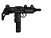|기관단총|원거리 무기|멀리 떨어져 있는 적을 조준해서 공격할 수 있는 무기|드랍 획득 가능, 빠른 공격속도, 낮은 대미지, 탄환이 탄튐이 꽤 있으며, 총알이 연속적으로 발사된다.|
 |후에 이미지 첨부|돌격소총|원거리 무기|멀리 떨어져 있는 적을 조준해서 공격할 수 있는 무기|드랍 획득 가능, 약간 빠른 공격속도, 보통 대미지, 탄튐이 약간 있으며 3발씩 발사된다.|
 |후에 이미지 첨부|산탄총|원거리 무기|약간 떨어져 있는 적들을 공격 가능한 무기|특수 획득 가능, 느린 공격 속도, 높은 대미지, 잘 맞추면 대미지가 높음, 한번에 여러발의 탄약 사용한다.|
 ||메디킷|소모성 아이템|1회성 아이템으로 플레이어의 체력을 회복시킨다.|

 

## 행동 분석

 

**1.플레이어**

 

|행동|설명|
|:---:|:---:|
|이동|입력한 방향키에 따라 이동|
|근접 공격|마우스 좌클릭을 했을 경우 캐릭터가 바라보고 있는 방향으로 현재 장착한 근접 무기의 공격이 이루어진다.|
|원거리 공격|마우스 우클릭을 했을 경우 클릭 위치로 현재 장착한 원거리 무기의 공격이 이루어진다.|
|회피|Space바를 누를 경우 플레이어가 누른 방향키로 구르기 모션이 이루어짐. 해당 모션 동안 캐릭터는 무적 시간을 갖는다.|
|회복|메디킷을 갖고 있는 상태에서 H키를 누르면 체력이 회복한다.|

 

**2.적**

 

|행동|설명|
|:---:|:---:|
|이동|일정 범위 내에 플레이어가 위치할 경우 플레이어 위치로 이동, 만약 일정 범위 내에 플레이어가 없을 경우 주변을 맴 돈다.|
|공격|플레이어가 일정 범위 내에 위치할 경우 일정 주기마다 공격이 이루어진다.|

 

## 파라미터 분석

 

**1.플레이어**

 

|속성|속성값|설명|비고|
|:---:|:---:|:---:|:---:|
|이동 방향|Vector2|입력한 방향키의 방향에 따라 플레이어가 이동한다.|현재 위치 벡터 * 이동속도|
|이동 속도|8f|플레이어의 이동 속도를 나타내는 값이다.||
|공격 주기|1f|공격이 이루어지고 다시 공격을 할때까지 걸리는 시간||
|공격 오브젝트|GameObejct|공격 버튼을 눌렀을 때 공격 명중 여부를 판단하는 오브젝트|근접 공격이면 정해진 위치에 오브젝트가 생기며 원거리 공격이면 투사체가 날아간다.|
|피격 주기|0.3f|피격 됐을 경우 계속해서 피격이 이루어지지 않게 막아주는 속성||
|회피 주기|1.8f|한 번 회피를 실행한 다음 다시 회피를 할때까지 걸리는 시간||
|체력|10|캐릭터의 체력을 나타내며 0이 될 경우 게임 오버가 된다.||
|오염 수치|0f|오염 구역에 들어갈 경우 수치가 상승하며 100이 될 경우 서서히 체력이 감소한다||

 

**2.적**

 

|속성|속성값|설명|비고|
|:---:|:---:|:---:|:---:|
|이동 방향|Vector3|적이 이동할 방향|목표 위치 벡터 - 적의 현재 위치 벡터|
|체력|25~50f|적의 체력 수치|적 타입의 따라 체력 수치가 다르다.|
|속도|25f|적의 이동 속도 수치|적 타입의 따라 이동속도 수치가 다르다.|
|도망 속도|30f|적의 도망 이동 속도 수치|원거리 적이 플레이어와 너무 가까워졌을 경우 뒤로 물러나는 속도 수치다.|
|공격 주기|3f|공격이 이루어지고 다시 공격을 할때까지 걸리는 시간||
|공격 오브젝트|GameObject|적이 공격할 때 공격 명중 여부를 판단하는 오브젝트|원거리 적일 경우 투사체가 날아가며 근접 적일 경우 정해진 위치에 오브젝트 생성한다.|

 

## 상태 분석

 

**1.플레이어**

 

|현상태|전이상태|전이조건|  
|:---:|:---:|:---:|
|대기|이동|방향키를 입력했을 경우|
|이동|회피|이동 중 회피키를 입력 했을 경우|
|회피|이동|회피의 모션이 끝났을 경우|
|대기|근접 공격|마우스 좌클릭을 했을 경우|
|근접 공격|대기|근접 공격 모션이 끝났을 경우|
|대기|원거리 공격|마우스 우클릭을 했을 경우|
|원거리 공격|대기|원거리 공격 모션이 끝났을 경우|
|생존|사망|체력이 0이 되었을 경우|

 

**2.적**

 

|현상태|전이상태|전이조건|  
|:---:|:---:|:---:|
|정찰|추적|플레이어가 적의 인식범위 내에 들어왔을 경우|
|추적|공격|현재 플레이어가 일정 범위 안에 있을 경우 |
|공격|대기|공격이 이루어지고 계속해서 공격이 이루어지지 않도록 대기 상태로 변환|
|추적|정찰|플레이어가 일정 범위 밖으로 벗어났을 경우|
|일반|광폭화|특정 시간대 밤이 되었을 경우|
|생존|사망|적의 체력이 0이 되었을 경우|  

 

## 게임 규칙

- 플레이어는 해당 맵을 탐사해나가면서 적을 물리친다.

- 마우스 왼쪽 클릭을 할 경우 근접 공격, 오른쪽 클릭을 할 경우 원거리 공격이 이루어진다.

- 플레이어는 지급되는 기본 근접, 원거리 무기를 갖고 있으며 다른 아이템은 드랍 또는 특수 획득으로 얻게 된다.

- 플레이어는 기본적으로 근거리 무기, 원거리 무기를 각각 하나씩만 보유 가능하며, 새로운 무기를 얻으면 기존 갖고 있는 무기는 버려진다.

- 오염 구역에 보조적인 아이템이 없이 들어갈 경우 플레이어의 오염 수치가 상승한다.

- 오염 수치가 가득 찰 경우 플레이어의 체력은 서서히 감소한다.

- 플레이어의 체력이 0이 될 경우 게임 오버가 된다.

- 시간이 흐르면 낮과 밤이 계속 바뀌며 특정 날 밤이 되면 적의 기본 능력이 높아지고, 적의 스폰 빈도가 활발해진다.

  

> # **개발 요구사항&흐름도**

***

 

## 개발 요구사항

 

### 게임 그래픽

1. 플레이어블 캐릭터나 적, 아이템 등의 스프라이트 제작.

2. 지하철 배경의 넓지만 협소한 맵

3. 소모성 아이템인 회복, 탄약 아이템과 비소모성 아이템인 무기, 장비 등을 구현

 

### UI

4. 화면 좌측 상단에는 플레이어의 체력바와 방사능 오염 수치를 나타내는 UI 구현한다.

5. 화면 좌측 하단에는 ...을 표시하는 UI, 우측 하단에는 ,,,을 표시하는 UI가 있다.

6. I키를 누르면 인벤토리 UI가 열리며 다시 I키를 누를 경우 인벤토리 UI가 닫힌다. 인벤토리 UI는 퀘스트 아이템을 확인할 수 있다.

7. F키를 누르면 상점 UI가 열리며 그 상태에서 Z키를 누르면 상점 UI가 닫힌다.

8. 적의 상단에는 남은 체력을 표시해주는 체력바가 존재하여 남은 체력을 알 수 있다.

 

### 게임 플레이

9. 플레이어는 이동한 방향키에 따라 움직인다. 카메라는 플레이어를 따라간다.

10. 플레이어는 공격을 받거나 방사능 오염 수치가 최대일 경우 체력이 감소한다.

11. 방사능 오염 수치는 오염 구역 진입 시 조금씩 상승한다.

12. 체력과 방사능 오염 수치는 소모성 아이템을 이용해 회복이 가능하다.

13. 특정 아이템을 이용하여면 방사능 오염 수치 상승을 막아준다.

14. 쿨타임이 있는 구르기 기능을 구현해 일정시간 동안 적의 공격을 무시한다.

15. 플레이어는 마우스 좌클릭을 할 경우 근접 공격, 우클릭을 할 경우 원거리 공격이 이루어진다.

16. 원거리 공격은 마우스 좌표에 따라 목표 위치가 달라진다.

17. 메디킷을 보유한 상태에서 H키를 누르면 체력이 회복된다.

18. 근접 무기는 아무 제약 없이 사용 가능하지만, 총기의 경우 소모성 아이템이 필요하다.

19. 적은 일정 범위 내를 배회하며 플레이어가 일정 범위 내에 존재할 경우 플레이어를 추적한다.

20. 적과 플레이어의 거리가 일정 수치로 좁혀질 경우 적은 공격한다.

21. 적을 일정 주기마다 정해진 수만큼 랜덤하게 스폰 시켜주는 스포너 오브젝트가 있다.

22. 적은 크게 일반 적과 정예 적으로 나눌 수 있으며 또 다시 일반적은 근접, 원거리 적으로 나눌 수 있다.

23. 정예 적은 일반 적과 다르게 스폰 주기가 길지만 기본 능력이 높아 상대하기 까다롭다.

24. 시간이 지나며 낮 밤 시간이 바뀌며 이와 같은 변화로 적의 기본 능력이 상승한다.

25. 생존자 구역에 거래가 가능한 NPC가 있으며 소모성 아이템 거래가 가능하다.

26. 맵의 각 구역을 일반 구역, 생존자 구역, 방사능 오염 구역, 돌연변이 출현 구역으로 나눈다.

27. 원거리 무기는 사용하려면 기본적으로 탄약이 필요하며 탄약이 없을 경우 총알이 나가지 않는다.

28. 권총은 기본 지급 원거리 무기이며, 총알이 한 발씩 나간다.

29. 기관단총은 드랍으로 얻을 수 있는 무기이며, 탄튐이 꽤 있다.

30. 돌격소총은 드랍으로 얻을 수 있는 무기이며, 탄튐이 약간 있다.

31. 산탄총은 특수 획득으로 얻을 수 있는 무기이며, 한번에 여러 발의 탄약을 사용한다.

32. 단검은 기본지급 무기이며, 사정 거리가 짧으며, 빠른 공격 속도와 약간 낮은 대미지가 특징이다.

33. 도끼는 드랍과 특수 획득 무기이며, 사정 거리가 방망이와 단검의 중간이며, 낮은 공격 속도와 높은 대미지가 특징이다.

34. 방망이는 드랍으로 얻을 수 있는 무기이며, 사정 거리가 넓으며, 약간 낮은 공격 속도와 약간 높은 대미지가 특징이다.

35. 프라이팬은 거래로 얻을 수 있는 무기이며, 빠른 공격 속도와 보통의 대미지, 적을 공격했을 경우 특수 소리가 난다.

36. 새로운 무기를 얻을 경우 기존의 소지하고 있는 무기는 버려지게 된다.

 

## 구현 완료

 

1. 플레이어는 이동한 방향키에 따라 움직인다. 카메라는 플레이어를 따라간다.

2. 플레이어는 마우스 좌클릭을 할 경우 근접 공격, 우클릭을 할 경우 원거리 공격이 이루어진다.

3. 원거리 공격은 마우스 좌표에 따라 목표 위치가 달라진다.

4. 적은 일정 범위 내를 배회하며 플레이어가 일정 범위 내에 존재할 경우 플레이어를 추적한다.

5. 적과 플레이어의 거리가 일정 수치로 좁혀질 경우 적은 공격한다.

6. I키를 누르면 인벤토리 UI가 열리며 다시 I키를 누를 경우 인벤토리 UI가 닫힌다.

7. 적을 일정 주기마다 정해진 수만큼 랜덤하게 스폰 시켜주는 스포너 오브젝트가 있다.

8. 메디킷을 보유한 상태에서 H키를 누르면 체력이 회복된다.

9. 쿨타임이 있는 구르기 기능을 구현해 일정시간 동안 적의 공격을 무시한다.

10. 플레이어의 체력바와 방사능 오염 수치를 나타내는 UI 구현.

11. F키를 누르면 상점 UI가 열리며 그 상태에서 Z키를 누르면 상점 UI가 닫힌다.

12. 적의 상단에는 남은 체력을 표시해주는 체력바가 존재하여 남은 체력을 알 수 있다.

 

## 키보드 이벤트 흐름도

 

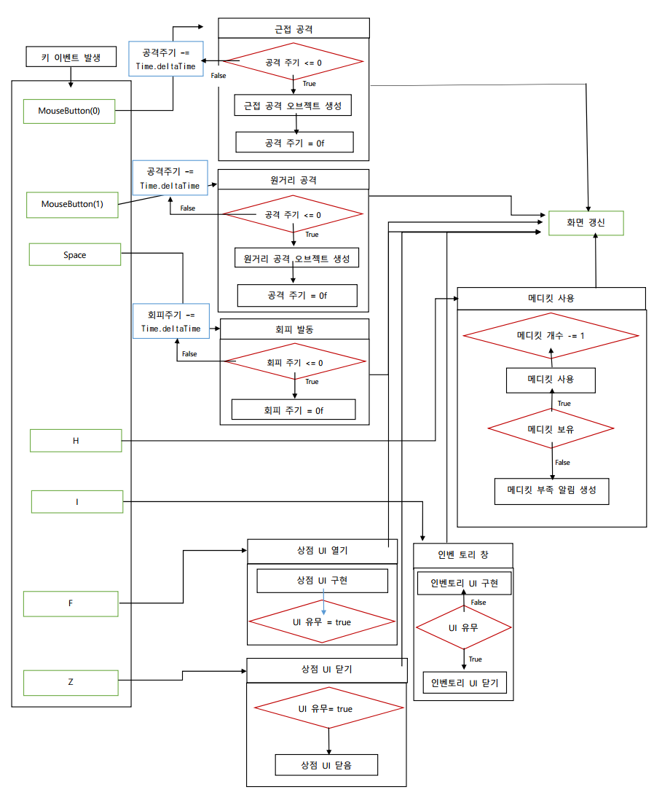

  

> # **개발 작업 일정**

***

 

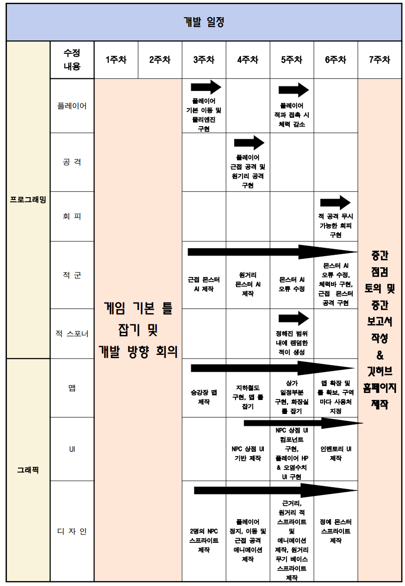

  

> # **주차별 개발 내용**
***

## 1주차

조를 짜서 팀을 만들고 자기소개를 하며 서로에 대해 알아가는 아이스 브레이킹 시간을 가졌다.

***

 

## 2주차

서로 어떠한 게임을 만들고 싶은지 의견을 낸 다음 의견을 종합하여 **2D 탑뷰 로그라이크 형식**의 생존을 목표로 하는 게임을 개발하기로 정했으며, 서로의 역할을 정했다.

 

|이름|담당|
|:---:|:---:|
|류태환|메인 디자인|
|황동석|레벨 디자인|
|성규민|플레이어 관련 담당|
|오단해|몬스터 및 AI 담당|
|김선우|시스템 및 NPC 담당|

 

***

## 3주차

 

|종류|구현 내용|
|:---:|:---:|
|**플레이어**|플레이어의 기본 이동 및 물리엔진을 구현|
|**적**|근접 몬스터 AI 제작|
|**맵**|맵 중 하나인 승강장 맵 제작|
|**스프라이트 디자인**|NPC 두 명의 스프라이트 제작|
|**NPC**|NPC의 대기 상태와 이동 애니메이션 시범 적용|

 

***

## 4주차

 

|종류|구현 내용|
|:---:|:---:|
|**플레이어**|플레이어의 근접 공격 및 원거리 공격을 구현|
|**적**|원거리 몬스터 AI 제작|
|**맵**|지하철도 구현, 맵 틀 잡기|
|**UI**|NPC 상점 UI 기반 제작|
|**스프라이트 디자인**|플레이어블 캐릭터의 정지, 이동, 근접 공격 애니메이션 제작|
|**NPC**|NPC와의 상호작용 구현|

 

***

## 5주차

 

|종류|구현 내용|
|:---:|:---:|
|**플레이어**|플레이어 적과 접촉 시 체력 감소|
|**적**|몬스터 AI 오류 수정, 정해진 범위 내에 랜덤한 적이 생성하도록 스포너 오브젝트 제작|
|**맵**|상가 일정부분, 화장실 틀 잡기|
|**UI**|NPC 상점 UI 컴포넌트 구현, 플레이어 HP & 오염 수치 UI 구현|
|**스프라이트 디자인**|근거리, 원거리 적 스프라이트 및 애니메이션 제작, 원거리 무기 베이스 스프라이트 제작|

 

***

## 6주차

 

|종류|구현 내용|
|:---:|:---:|
|**플레이어**|적 공격 무시 가능한 회피 시스템 구현|
|**적**|몬스터 AI 오류 수정, 근접 몬스터 공격 구현|
|**맵**|맵 확장 및 틀 확보, 구역 마다 사용처 지정|
|**UI**|인벤토리 UI 제작, 적 체력바 구현|
|**스프라이트 디자인**|정예 몬스터 스프라이트 제작|

 

***

## 7주차

**캡스톤 중간 점검 토의 및 중간 보고서**를 작성하였으며, 깃허브 홈페이지에서 **게임 소개 홈페이지**를 제작했다.