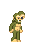
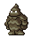
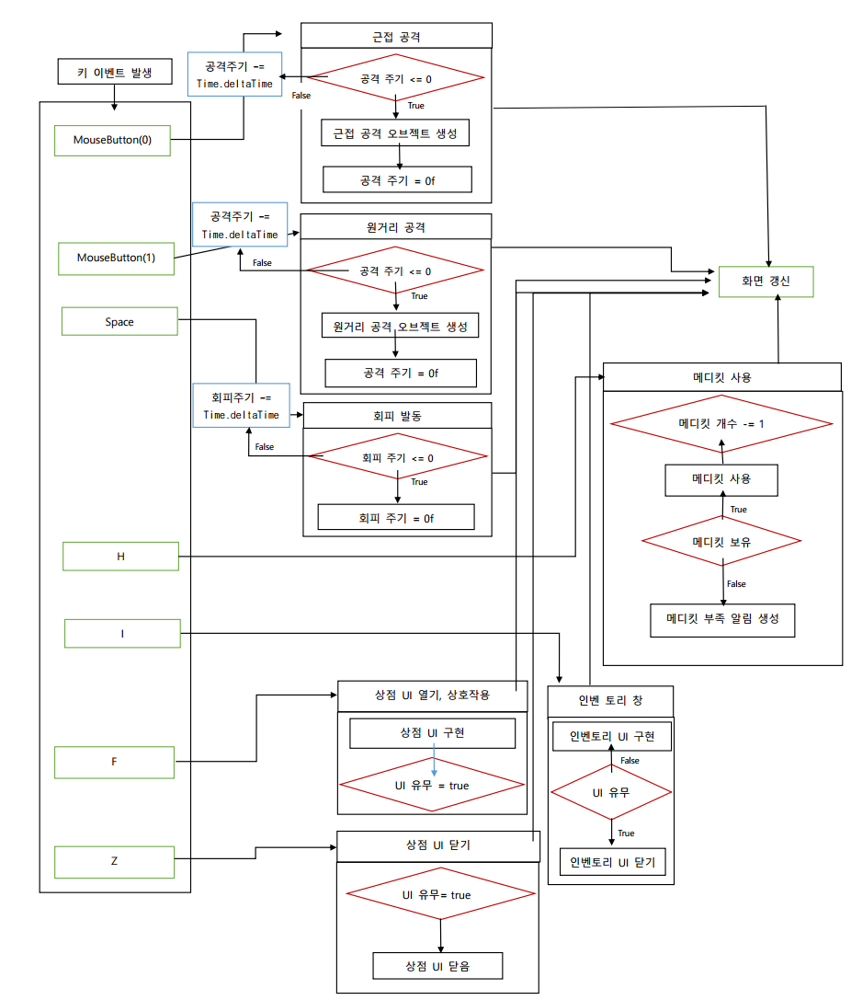

# 각 만든 게임 소개

    
프로젝트 명 : 레전드 오브 슬래셔

# 레전드 오브 슬래셔 (오단해)

## 목차
-[컨셉](#컨셉)
-[관련 이미지 & 동영상](#관련-이미지-&-동영상)
-[대표 이미지](#대표-이미지)

# **컨셉**
***
 

|컨셉|키워드|설명|
|:---:|:---:|:---:|
|메인 컨셉|**타격감**|계속해서 몰려오는 적들이라는 무쌍류 게임의 특징과 이를 헤쳐나가기 위해 적들을 공격하고 처리하는 과정에서 쉬원한 **타격감**을 느낄 수 있을 거라 생각했다.|
|서브 컨셉 1|**소리**|오감 중 하나인 청각을 이용한 **청각적 효과**로 청각을 자극 시켜준다. 영화나 다른 게임에서도 소리는 중요한 위치를 차지하고 있으며 소리가 없을 경우 얻을 수 있는 느낌이 반감된다. 각각 공격에 맞는 효과음을 넣어 타격감을 증폭 시켜준다. 또한 적이 쓰러지는 효과음으로 적이 쓰러졌음을 인지하여 타격감과 시원한 게임 진행을 느끼게 한다. 또한 무기 종류가 다른 경우 다른 효과음을 넣어 A라는 무기와 B라는 무기의 타격감이 다르게 느낄 수 있도록 만들어준다.|
|서브 컨셉 2|**이펙트**|**시각적 효과**로 오감 중 하나인 시각을 자극시켜주며 청각과 더불어 조화되며 타격감에 대한 느낌을 증폭시켜준다. 약공격에는 작은 이펙트를 넣어주고 강공격에는 큰 이펙트를 넣어주며 필살기에도 필살기에 맞는 이펙트를 넣어준다. 각 공격에 맞는 이펙트를 구현한다.|
|서브 컨셉 3|**필살기**|일반 공격과는 다르게 더 강력하고 넓은 공격 범위로 더 많은 적들을 한꺼번에 처치할 수 있으며 일반 공격과는 다른 타격감을 유저에게 선사할 수 있다. 필살기를 사용하기 위해서는 적을 처치하면 게이지가 차면서 처치하지 못했더라도 주기마다 공격을 했을 경우 게이지가 채워지는 형식으로 구상하고 있다.|
|서브 컨셉 4|**다양한 공격**|아무리 소리와 이펙트가 좋아도 공격이 단순화되면 게임을 진행하는 유저들은 지루함을 느낄 수 있다 생각한다. 먼저 공격 무기 종류를 2가지 종류 (검, 둔기)로 생각하고 있으며 각각 무기에 약공격, 강공격으로 나누고 공격 도중에 필살기를 넣어 자신만에 콤보를 만드는 등 다양한 공격을 할 수 있다.|
|서브 컨셉 5|**몬스터 웨이브**|중간중간에 적이 없는 시간이 있으면 타격감을 느낄 수 있는 시간이 반감될 수 있다고 생각했다. 그래서 적들이 생성될 수 있는 최대 수량을 제한을 하고 짧은 주기로 계속해서 생성하게 만들며 이러한 적들의 생성은 클리어 목표가 달성할 때 까지 지속된다.|

  

# **관련 이미지 & 동영상**
***

구상 중인 게임과 유사한 인게임 사진으로 넓은 맵에서 플레이어에게 몰려오는 수많은 적들을 잡으며 진행하는 게임이다.

위 사진들과 같이 수많은 적들이 계속해서 몰려오며 플레이어의 hp가 0이 되지 않도록 적을 잡으며 게임을 진행한다. 게임 상의 UI는 HP바, 지도, 필살기 게이지가 구현되며 위 사진과는 UI의 위치가 차이가 있다.

공격은 약공격과 강공격 두 가지로 나뉘어서 이를 조합해서 **다양한 공격**을 할 수 있도록 구상 중이다.

**필살기 게이지** UI는 화면 우측 하단에 위치하여 필살기 사용이 가능한지 여부를 확인할 수 있도록 나타내줍니다.

  

# **대표 이미지**

  

# 컨셉 & 대표이미지 기반 작품묘사

> ### 대표이미지 기반 : 
> ### 컨셉 기반 :

  

# 레전드 오브 슬래셔 구성 요소

## 1. 메커니즘
도전과제
1. 계속해서 나오는 적을 일정 수량 이상 잡는다.

2. 적들로부터 특정 오브젝트 (동료 NPC 또는 텐트 오브젝트 등)가 부서지지 않도록 지킨다.

3. 적들로부터 일정 시간 동안 살아남는다.

 

재미요소
1. 계속해서 나오는 적들을 공격으로 시원시원하게 잡는 시원함을 준다.

2. 일반공격과 강공격, 필살기를 통하여 자신만의 콤보를 만들어 많은 적들을 잡는다.

3. 각 스테이지 마다 클리어 조건이 달라 적극적으로 적을 잡거나 수비적으로 진행해야 하는 등 전략이 달라진다.

4. 무기는 2종류로 자신에게 맞는 무기를 선택하여 플레이가 가능하다.

 

## 2. 이야기

만들게 된 배경
일반 공격과 강공격, 필살기로 이루어진 간단한 공격과 키보드 조작 방식으로 쉽게 즐길 수 있으며 자신만의 공격 조합으로 많은 적들을 잡으면서 이 과정에서 느껴지는 시원함과 타격감을 느낄 수 있으면 좋겠다고 생각하였다.

참신함
필살기 게이지는 적을 잡을 때만 차는 것이 아니라 적을 공격했을 경우 일정 게이지가 회복이 가능하다. 이를 통하여 빠르게 필살기 게이지가 채워져서 빠른 재사용으로 시원함을 준다.

카메라 관점
플레이어의 등을 보여주는 3인칭 카메라 관점으로 카메라 회전키로 각 방향에서 접근 해오는 적들을 확인할 수 있게 한다.

 

## 3. 미적 요소

디자인 및 컬러
흙과 잔디가 있는 평야에 캐릭터가 위치하며 배경으로는 파란 하늘과 나무, 숲이 보입니다. 스테이지에 따라 밤과 낮을 나누어 어두운 배경과 밝은 배경으로 나누어진다. 캐릭터는 중세시대 기사나 판타지 세계관에서 볼 수 있는 갑옷을 입고 있는 남성형 캐릭터이며 적 캐릭터도 판타지 세계관에서 흔히 보이는 고블린과 오크와 같은 디자인으로 구현한다.

음향
적을 공격했을 경우 생기는 효과음을 만든다. 이 효과음은 무기의 종류에 따라 다르다. 적들의 공격과 피격 소리, 플레이어 캐릭터의 기합 소리와 피격 소리를 구현한다. 일정 수 이상 적을 처치했을 경우 이를 알려주는 감탄 효과음을 넣는다.

 

## 4. 기술

현재 자신이 갖고 있는 코딩 지식과 인터넷에서 얻을 수 있는 코딩의 팁과 유니티의 기술을 최대한 활용하여 게임을 구현한다.

    
Metro Survival

    
# Metro Survival

> ## 목차
- [목차](#목차)
- [게임 소개](#게임-소개)
- [세계관(배경)](#세계관배경)
- [게임 컨셉](#게임-컨셉)
- [캐릭터 소개](#캐릭터-소개)
    - [플레이어](#플레이어)
        - [조작방법](#조작-방법)
    - [적](#적)
        - [일반 적](#일반-적)
        - [정예 적](#정예-적)
    - [NPC](#npc)
- [게임 시스템 디자인](#게임-시스템-디자인)
    - [아이템](#아이템)
    - [행동 분석](#행동-분석)
    - [파라미터 분석](#파라미터-분석)
    - [상태 분석](#상태-분석)
    - [게임 규칙](#게임-규칙)
    - [UI 분석](#ui-분석)
- [개발 요구사항&흐름도](#개발-요구사항흐름도)
    - [개발 요구사항](#개발-요구사항)
        - [구현 완료](#구현-완료)
    - [키보드 이벤트 흐름도](#키보드-이벤트-흐름도)
- [개발 작업 일정](#개발-작업-일정)
- [주차별 개발 내용](#주차별-개발-내용)
    - [1주차](#1주차)
    - [2주차](#2주차)
    - [3주차](#3주차)
    - [4주차](#4주차)
    - [5주차](#5주차)
    - [6주차](#6주차)
    - [7주차](#7주차)
    - [8주차](#8주차)
    - [9주차](#9주차)
    - [10주차](#10주차)
    - [11주차](#11주차)
    - [12주차](#12주차)
    - [13주차](#13주차)
    - [14주차](#14주차)
    - [15주차](#15주차)

   

> #  **게임 소개**
***

 

본 게임은 유니티를 활용하여 도트 그래픽을 기반으로 한 탑뷰 형식의 로그라이크의 2D게임이다.

플레이어는 캐릭터를 조작하며 마주치는 적을 물리치고 NPC와 상호작용을 하며 생존을 거듭해 나간다.

캐쥬얼한 그래픽과 그에 상반되는 어두운 세계관을 갖는 특징이 있다.

  

> # **세계관(배경)**
***
 

 

핵 전쟁으로 인해 지상에서 생활은 어려워졌다. 핵으로 인한 오염 구역이 퍼지기 시작하여 지상에서 생활은 어려워지기 시작하고 남은 생존자들은 지하철로 도망갔다.

하지만 지하철도의 모든 구역이 안전한 장소가 아니었으며, 오염이 시작된 장소가 생기면서 이로 인한 돌연변이 생물이 나타나기 시작한다.

주인공은 이러한 상황 속에서 살아남기 위해 싸우고 다른 인물과 거래를 하며 생존한다.

  

> # **게임 컨셉**

 

 

## **2D 로그라이크 게임**

**2D 도트** 게임으로 **탑뷰** 형식의 게임이며 **로그라이크** 스타일의 게임이다. 게임의 배경이 되는 지하철에서 플레이어는 여러 곳을 돌아다니며 한정된 자원으로 최대한 오래 살아남는 생존을 목표로 플레이하게 된다.

 

## **생존**

본 게임은 플레이어가 지하철에서 다가오는 적의 공격을 피하고 처치하며 위험한 오염 구역에 아무런 대비 없이 들어가면 체력이 감소하는 등 모든 플레이 중에는 **생존**을 염두에 두며 플레이를 해야한다.

 

## **한정된 자원**

기본 무기는 단검과 권총만 갖고 있어 적의 공격에 주의를 하며 원거리 무기는 멀리서 적을 공격할 수 있지만 **한정된 자원**의 문제로 사용해야 할 시기를 생각해서 사용해야 한다.

  

> # **캐릭터 소개**

***

## 플레이어

 
 

 
 

### 조작 방법

|입력키|설명|
|:---:|:---:|
|WASD|각 방향으로 입력시 플레이어가 해당 방향으로 이동한다.|
|좌클릭|현재 플레이어가 바라보고 있는 방향으로 근접 공격을 실행한다.|
|우클릭|마우스 포인터가 위치한 방향으로 원거리 공격을 실행한다.|
|Space 바|플레이어가 구르면서 공격을 회피한다.|
|H|현재 메디킷을 보유하고 있으면 메디킷을 소모해 체력을 회복한다.|
|I|인벤토리를 열고 닫을 수 있다.|
|F|오브젝트와 상호작용을 하거나 상점 NPC와 거래가 가능하다.|
|Z|상점을 닫을 수 있다.|

 

## 적

  

### 일반 적

|적 종류|이미지|설명|체력|획득 재화|
|:---:|:---:|:---:|:---:|:---:|
|근접 적||플레이어가 일정 거리 내에 위치할 경우 근접 공격을 하는 적|35|300~450|
|근접 적 바리에이션||플레이어가 일정 거리 내에 위치할 경우 근접 공격을 하는 적, 원래 적보다 기본 능력이 더 높다.|55|700~900|
|원거리 적||플레이어를 인식한 후 일정 거리 내에 위치할 경우 원거리 공격을 하고 너무 가까우면 뒤로 물러나는 적|22|350~450|
|원거리 적 바리에이션||플레이어를 인식한 후 일정 거리 내에 위치할 경우 원거리 공격을 하고 너무 가까우면 뒤로 물러나는 적, 원래 적보다 기본 능력이 더 높다.|48|800~1000|

 

### 정예 적

|적 종류|이미지|설명|체력|획득 재화|
|:---:|:---:|:---:|:---:|:---:|
|근접 정예 적||일반 적보다 기본 능력이 높으며 근접 공격만 하는 정예 적|80|2400~2600|

 

## NPC

|NPC 종류|이미지|설명|
|:---:|:---:|:---:|
|무기 상인||안전지대에 위치해 있으며 플레이어에게 무기 등을 판매한다.|
|의사||안전지대에 있으며 체력 회복, 방사능 오염 수치 하락 등 상호작용 가능|

  

> # **게임 시스템 디자인**

 

## 아이템
 
|이미지|이름|종류|설명|비고|
|:---:|:---:|:---:|:---:|:---:|
||단검|근접 무기|근접한 적을 공격 가능한 무기|기본 지급, 짧은 사거리, 빠른 공격속도, 대미지 9|
||도끼|근접 무기|근접한 적을 공격 가능한 무기|드랍 또는 특수 획득 가능, 중간 사거리, 낮은 공격 속도, 대미지 16|
||방망이|근접 무기|근접한 적을 공격 가능한 무기|드랍 획득 가능, 넓은 사거리, 약간 낮은 공격 속도, 대미지 13|
||프라이팬|근접 무기|근접한 적을 공격 가능한 무기, 공격시 탱탱 소리가 난다.|거래 획득 가능, 짧은 사거리, 빠른 공격 속도, 대미지 6|
||권총|원거리 무기|멀리 떨어져 있는 적을 조준해서 공격할 수 있는 무기|기본 지급, 보통 공격속도, 대미지 5, 1발씩 발사|
||기관단총|원거리 무기|멀리 떨어져 있는 적을 조준해서 공격할 수 있는 무기|드랍 획득 가능, 빠른 공격속도, 대미지 5, 탄환이 탄튐이 꽤 있으며, 총알이 연속적으로 발사|
||돌격소총|원거리 무기|멀리 떨어져 있는 적을 조준해서 공격할 수 있는 무기|드랍 획득 가능, 약간 빠른 공격속도, 대미지 10, 탄튐이 약간 있으며 3발씩 발사|
||산탄총|원거리 무기|약간 떨어져 있는 적들을 공격 가능한 무기|특수 획득 가능, 느린 공격 속도, 높은 대미지, 대미지 6, 한번에 여러발의 탄약 사용|
||메디킷|소모성 아이템|1회성 아이템으로 플레이어의 체력을 회복|아이템 획득 후 H키를 누르면 사용 가능|
||탄약|소모성 아이템|1회성 아이템으로 원거리 공격을 하기 위해서 필요한 아이템|한번 쏠 때마다 탄약 하나가 소모|
||알약|소모성 아이템|1회성 아이템으로 오염수치를 회복시켜주는 아이템|얻을 경우 즉시 사용|
||방독면|소모성 아이템|1회성 아이템으로 방독면을 획득할 경우 방독면의 게이지가 다 소모되기 전까지 방사능 오염수치를 막아줌|얻을 경우 즉시 사용|

 

## 행동 분석

 

**1.플레이어**

|행동|설명|
|:---:|:---:|
|이동|입력한 방향키에 따라 이동|
|근접 공격|마우스 좌클릭을 했을 경우 캐릭터가 바라보고 있는 방향으로 현재 장착한 근접 무기의 공격이 이루어진다.|
|원거리 공격|마우스 우클릭을 했을 경우 클릭 위치로 현재 장착한 원거리 무기의 공격이 이루어진다.|
|회피|Space바를 누를 경우 플레이어가 누른 방향키로 구르기 모션이 이루어짐. 해당 모션 동안 캐릭터는 무적 시간을 갖는다.|
|회복|메디킷을 갖고 있는 상태에서 H키를 누르면 체력이 회복한다.|

 

**2.적**

|행동|설명|
|:---:|:---:|
|이동|특정 구역 내에 플레이어가 위치할 경우 플레이어 위치로 이동, 만약 특정 구역 내에 플레이어가 없을 경우 주변을 맴 돈다.|
|공격|플레이어가 일정 범위 내에 위치할 경우 일정 주기마다 공격이 이루어진다.|

 

## 파라미터 분석

 

**1.플레이어**

|속성|속성값|설명|비고|
|:---:|:---:|:---:|:---:|
|이동 방향|Vector2|입력한 방향키의 방향에 따라 플레이어가 이동한다.|현재 위치 벡터 * 이동속도|
|이동 속도|8f|플레이어의 이동 속도를 나타내는 값이다.||
|공격 주기|1f|공격이 이루어지고 다시 공격을 할때까지 걸리는 시간||
|공격 오브젝트|GameObejct|공격 버튼을 눌렀을 때 공격 명중 여부를 판단하는 오브젝트|근접 공격이면 정해진 위치에 오브젝트가 생기며 원거리 공격이면 투사체가 날아간다.|
|피격 주기|0.3f|피격 됐을 경우 계속해서 피격이 이루어지지 않게 막아주는 속성||
|회피 주기|1.8f|한 번 회피를 실행한 다음 다시 회피를 할때까지 걸리는 시간||
|체력|10|캐릭터의 체력을 나타내며 0이 될 경우 게임 오버||
|오염 수치|0f|수치가 천천히 감소하며 0이 될 경우 서서히 체력이 감소한다||

 

**2.적**

|속성|속성값|설명|비고|
|:---:|:---:|:---:|:---:|
|이동 방향|Vector3|적이 이동할 방향|목표 위치 벡터 - 적의 현재 위치 벡터|
|체력|22~80f|적의 체력 수치|적 타입의 따라 체력 수치가 다름|
|속도|6f|적의 이동 속도 수치|적 타입의 따라 이동속도 수치가 다름|
|도망 속도|6f|적의 도망 이동 속도 수치|원거리 적이 플레이어와 너무 가까워졌을 경우 뒤로 물러나는 속도 수치|
|공격 주기|3f|공격이 이루어지고 다시 공격을 할때까지 걸리는 시간||
|공격 오브젝트|GameObject|적이 공격할 때 공격 명중 여부를 판단하는 오브젝트|원거리 적일 경우 투사체가 날아가며 근접 적일 경우 정해진 위치에 오브젝트 생성|
|드랍 확률|int|적이 죽을 경우 랜덤의 값을 정한 다음 해당 값이 특정 범위에 속하면 해당되는 아이템을 생성|Random.Range(1,101)|

 

## 상태 분석

 

**1.플레이어**

|현상태|전이상태|전이조건|  
|:---:|:---:|:---:|
|대기|이동|방향키를 입력했을 경우|
|이동|회피|이동 중 회피키를 입력 했을 경우|
|회피|이동|회피의 모션이 끝났을 경우|
|대기|근접 공격|마우스 좌클릭을 했을 경우|
|근접 공격|대기|근접 공격 모션이 끝났을 경우|
|대기|원거리 공격|마우스 우클릭을 했을 경우|
|원거리 공격|대기|원거리 공격 모션이 끝났을 경우|
|생존|사망|체력이 0이 되었을 경우|

 

**2.적**

|현상태|전이상태|전이조건|  
|:---:|:---:|:---:|
|정찰|추적|플레이어가 특정 구역 내에 들어왔을 경우|
|추적|공격|현재 플레이어가 일정 범위 안에 있을 경우 |
|공격|대기|공격이 이루어지고 계속해서 공격이 이루어지지 않도록 대기 상태로 변환|
|추적|정찰|플레이어가 일정 범위 밖으로 벗어났을 경우|
|생존|사망|적의 체력이 0이 되었을 경우|

 

**3.스포너**

|현상태|전이상태|전이조건|
|:---:|:---:|:---:|
|대기|스폰|플레이어가 특정 구역 내에 들어왔을 경우 적을 스폰|
|스폰|대기|플레이어가 특정 구역 밖으로 벗어나거나 적이 최대 스폰 수가 됐을 경우 스폰을 멈춤|

 

## 게임 규칙

- 플레이어는 해당 맵을 탐사해나가면서 적을 물리친다.

- 마우스 왼쪽 클릭을 할 경우 근접 공격, 오른쪽 클릭을 할 경우 원거리 공격이 이루어진다.

- 플레이어는 지급되는 기본 근접, 원거리 무기를 갖고 있으며 다른 아이템은 드랍 또는 특수 획득으로 얻게 된다.

- 플레이어는 기본적으로 근거리 무기, 원거리 무기를 각각 하나씩만 보유 가능하며, 새로운 무기를 얻으면 기존 갖고 있는 무기는 인벤토리로 이동한다.

- 오염 수치는 시간이 지날수록 떨어지며 아이템을 통해 회복할 수 있다.

- 오염 수치가 가득 찰 경우 플레이어의 체력은 서서히 감소한다.

- 플레이어의 체력이 0이 될 경우 게임 오버가 된다.

 

## UI 분석

 

- 좌상단에 보이는 빨강색 바는 플레이어의 현재 체력을 나타내며 0이 될 경우 게임오버가 된다.

- 좌상단에 보이는 초록색 바는 플레이어의 현재 오염 수치를 나태내며 시간이 지나면 감소하게 된다.

- 우측 하단 UI는 위에서부터 차례대로 현재 보유 메디킷, 현재 보유 소지금, 현재 보유 탄환을 나타낸다.

  

> # **개발 요구사항&흐름도**

***

 

## 개발 요구사항

 

### 게임 그래픽

1. 플레이어블 캐릭터나 적, 아이템 등의 스프라이트 제작.

2. 지하철 배경의 넓지만 협소한 맵

3. 소모성 아이템인 회복, 탄약 아이템과 비소모성 아이템인 무기, 장비 등을 구현

 

### UI

4. 화면 좌측 상단에는 플레이어의 체력바와 방사능 오염 수치를 나타내는 UI 구현한다.

5. I키를 누르면 인벤토리 UI가 열리며 다시 I키를 누를 경우 인벤토리 UI가 닫힌다.

6. F키를 누르면 상점 UI가 열리며 그 상태에서 Z키를 누르면 상점 UI가 닫힌다.

7. 적의 상단에는 남은 체력을 표시해주는 체력바가 존재하여 남은 체력을 알 수 있다.

8. 타이틀 씬, 게임오버 씬, 게임 조작 설명 씬을 구현한다.

 

### 게임 플레이

9. 플레이어는 이동한 방향키에 따라 움직인다. 카메라는 플레이어를 따라간다.

10. 플레이어는 공격을 받거나 방사능 오염 수치가 최대일 경우 체력이 감소한다.

11. 방사능 오염 수치는 오염 구역 진입 시 조금씩 상승한다.

12. 체력과 방사능 오염 수치는 소모성 아이템을 이용해 회복이 가능하다.

13. 특정 아이템을 이용하면 방사능 오염 수치 상승을 막아준다.

14. 쿨타임이 있는 구르기 기능을 구현해 일정시간 동안 적의 공격을 무시한다.

15. 플레이어는 마우스 좌클릭을 할 경우 근접 공격, 우클릭을 할 경우 원거리 공격이 이루어진다.

16. 원거리 공격은 마우스 좌표에 따라 목표 위치가 달라진다.

17. 메디킷을 보유한 상태에서 H키를 누르면 체력이 회복된다.

18. 근접 무기는 아무 제약 없이 사용 가능하지만, 총기의 경우 소모성 아이템이 필요하다.

19. 적은 일정 범위 내를 배회하며 플레이어가 일정 범위 내에 존재할 경우 플레이어를 추적한다.

20. 적과 플레이어의 거리가 일정 수치로 좁혀질 경우 적은 공격한다.

21. 적을 일정 주기마다 정해진 수만큼 랜덤하게 스폰 시켜주는 스포너 오브젝트가 있다.

22. 적은 크게 일반 적과 정예 적으로 나눌 수 있으며 또 다시 일반적은 근접, 원거리 적으로 나눌 수 있다.

23. 정예 적은 일반 적과 다르게 스폰 주기가 길지만 기본 능력이 높아 상대하기 까다롭다.

24. 시간이 지나며 낮 밤 시간이 바뀌며 이와 같은 변화로 적의 기본 능력이 상승한다.

25. 생존자 구역에 거래가 가능한 NPC가 있으며 소모성 아이템 거래가 가능하다.

26. 맵의 각 구역을 일반 구역, 생존자 구역, 방사능 오염 구역, 돌연변이 출현 구역으로 나눈다.

27. 원거리 무기는 사용하려면 기본적으로 탄약이 필요하며 탄약이 없을 경우 총알이 나가지 않는다.

28. 권총은 기본 지급 원거리 무기이며, 총알이 한 발씩 나간다.

29. 기관단총은 드랍으로 얻을 수 있는 무기이며, 탄튐이 꽤 있다.

30. 돌격소총은 드랍으로 얻을 수 있는 무기이며, 탄튐이 약간 있다.

31. 산탄총은 특수 획득으로 얻을 수 있는 무기이며, 한번에 여러 발의 탄약을 사용한다.

32. 단검은 기본지급 무기이며, 사정 거리가 짧으며, 빠른 공격 속도와 약간 낮은 대미지가 특징이다.

33. 도끼는 드랍과 특수 획득 무기이며, 사정 거리가 방망이와 단검의 중간이며, 낮은 공격 속도와 높은 대미지가 특징이다.

34. 방망이는 드랍으로 얻을 수 있는 무기이며, 사정 거리가 넓으며, 약간 낮은 공격 속도와 약간 높은 대미지가 특징이다.

35. 프라이팬은 거래로 얻을 수 있는 무기이며, 빠른 공격 속도와 보통의 대미지, 적을 공격했을 경우 특수 소리가 난다.

36. 새로운 무기로 바꿀 경우 기존의 사용 무기는 인벤토리에 들어간다.

37. 이벤트 아이템 Key를 만들어 이를 사용하면 닫힌 통제실의 문이 열린다.

38. 방화벽은 처음에 닫혀있으며 통제실에서 컴퓨터와 상호작용을 하면 방화벽이 열린다.

39. 몬스터가 죽으면 랜덤으로 드롭 아이템과 재화를 획득하게 한다.

40. 상점에서 아이템 구매와 판매를 할 수 있다.

41. 특정 구역 내에 플레이어가 들어올 경우 이를 탐지하여 몬스터가 스폰이 실행된다.

42. 필드 아이템을 획득 시 인벤토리에 들어가게 된다.

43. 인벤토리는 기본 4칸으로 확장할 수 있다.

44. 인벤토리에 있는 아이템을 클릭하면 사용이 가능하다.

 

## 구현 완료

 

1. 플레이어는 이동한 방향키에 따라 움직인다. 카메라는 플레이어를 따라간다.

2. 플레이어는 마우스 좌클릭을 할 경우 근접 공격, 우클릭을 할 경우 원거리 공격이 이루어진다.

3. 원거리 공격은 마우스 좌표에 따라 목표 위치가 달라진다.

4. 적은 일정 범위 내를 배회하며 플레이어가 일정 범위 내에 존재할 경우 플레이어를 추적한다.

5. 적과 플레이어의 거리가 일정 수치로 좁혀질 경우 적은 공격한다.

6. I키를 누르면 인벤토리 UI가 열리며 다시 I키를 누를 경우 인벤토리 UI가 닫힌다.

7. 적을 일정 주기마다 정해진 수만큼 랜덤하게 스폰 시켜주는 스포너 오브젝트가 있다.

8. 메디킷을 보유한 상태에서 H키를 누르면 체력이 회복된다.

9. 쿨타임이 있는 구르기 기능을 구현해 일정시간 동안 적의 공격을 무시한다.

10. 화면 좌측 상단에는 플레이어의 체력바와 방사능 오염 수치를 나타내는 UI 구현한다.

11. F키를 누르면 상점 UI가 열리며 그 상태에서 Z키를 누르면 상점 UI가 닫힌다.

12. 적의 상단에는 남은 체력을 표시해주는 체력바가 존재하여 남은 체력을 알 수 있다.

13. 정예 적은 일반 적과 다르게 스폰 주기가 길지만 기본 능력이 높아 상대하기 까다롭다.

14. 인벤토리에 있는 아이템을 클릭하면 사용이 가능하다.

15. 인벤토리는 기본 4칸으로 확장할 수 있다.

16. 필드 아이템을 획득 시 인벤토리에 들어가게 된다.

17. 돌격소총은 드랍으로 얻을 수 있는 무기이며, 탄튐이 약간 있다.

18. 방사능 오염 수치는 오염 구역 진입 시 조금씩 상승한다.

19. 단검은 기본지급 무기이며, 사정 거리가 짧으며, 빠른 공격 속도와 약간 낮은 대미지가 특징이다.

20. 도끼는 드랍과 특수 획득 무기이며, 사정 거리가 방망이와 단검의 중간이며, 낮은 공격 속도와 높은 대미지가 특징이다.

21. 방망이는 드랍으로 얻을 수 있는 무기이며, 사정 거리가 넓으며, 약간 낮은 공격 속도와 약간 높은 대미지가 특징이다.

22. 프라이팬은 거래로 얻을 수 있는 무기이며, 빠른 공격 속도와 보통의 대미지, 적을 공격했을 경우 특수 소리가 난다.

23. 이벤트 아이템 Key를 만들어 이를 사용하면 닫힌 통제실의 문이 열린다.

24. 방화벽은 처음에 닫혀있으며 통제실에서 컴퓨터와 상호작용을 하면 방화벽이 열린다.

25. 기관단총은 드랍으로 얻을 수 있는 무기이며, 탄튐이 꽤 있다.

26. 산탄총은 특수 획득으로 얻을 수 있는 무기이며, 한번에 여러 발의 탄약을 사용한다.

27. 상점에서 아이템 구매와 판매를 할 수 있다.

28. 몬스터가 죽으면 랜덤으로 드롭 아이템과 재화를 획득하게 한다.

29. 원거리 무기는 사용하려면 기본적으로 탄약이 필요하며 탄약이 없을 경우 총알이 나가지 않는다.

30. 특정 아이템을 이용하면 방사능 오염 수치 상승을 막아준다.

31. 타이틀 씬, 게임오버 씬, 게임 조작 설명 씬을 구현한다.

32. 새로운 무기로 바꿀 경우 기존의 사용 무기는 인벤토리에 들어간다.

33. 체력과 방사능 오염 수치는 소모성 아이템을 이용해 회복이 가능하다.

34. 플레이어는 공격을 받거나 방사능 오염 수치가 최대일 경우 체력이 감소한다.

35. 소모성 아이템인 회복, 탄약 아이템과 비소모성 아이템인 무기, 장비 등을 구현

36. 지하철 배경의 넓지만 협소한 맵

37. 플레이어블 캐릭터나 적, 아이템 등의 스프라이트 제작.

38. 생존자 구역에 거래가 가능한 NPC가 있으며 소모성 아이템 거래가 가능하다.

39. 근접 무기는 아무 제약 없이 사용 가능하지만, 총기의 경우 소모성 아이템이 필요하다.

40. 특정 구역 내에 플레이어가 들어올 경우 이를 탐지하여 몬스터가 스폰이 실행된다.

 

## 키보드 이벤트 흐름도

 

  

> # **개발 작업 일정**

***

 

  

> # **주차별 개발 내용**
***

## 1주차

조를 짜서 팀을 만들고 자기소개를 하며 서로에 대해 알아가는 아이스 브레이킹 시간을 가졌다.

 

***

## 2주차

서로 어떠한 게임을 만들고 싶은지 의견을 낸 다음 의견을 종합하여 **2D 탑뷰 로그라이크 형식**의 생존을 목표로 하는 게임을 개발하기로 정했으며, 서로의 역할을 정했다.

 

|이름|담당|
|:---:|:---:|
|류태환|메인 디자인|
|황동석|레벨 디자인|
|성규민|플레이어 관련 담당|
|오단해|몬스터 및 AI 담당|
|김선우|시스템 및 NPC 담당|

 

***

## 3주차

 

|종류|구현 내용|
|:---:|:---:|
|**플레이어**|플레이어의 기본 이동 및 물리엔진을 구현|
|**적**|근접 몬스터 AI 제작|
|**맵**|맵 중 하나인 승강장 맵 제작|
|**스프라이트 디자인**|NPC 두 명의 스프라이트 제작|
|**NPC**|NPC의 대기 상태와 이동 애니메이션 시범 적용|

 

***

## 4주차

 

|종류|구현 내용|
|:---:|:---:|
|**플레이어**|플레이어의 근접 공격 및 원거리 공격을 구현|
|**적**|원거리 몬스터 AI 제작|
|**맵**|지하철도 구현, 맵 틀 잡기|
|**UI**|NPC 상점 UI 기반 제작|
|**스프라이트 디자인**|플레이어블 캐릭터의 정지, 이동, 근접 공격 애니메이션 제작|
|**NPC**|NPC와의 상호작용 구현|

 

***

## 5주차

 

|종류|구현 내용|
|:---:|:---:|
|**플레이어**|플레이어 적과 접촉 시 체력 감소|
|**적**|몬스터 AI 오류 수정, 정해진 범위 내에 랜덤한 적이 생성하도록 스포너 오브젝트 제작|
|**맵**|상가 일정부분, 화장실 틀 잡기|
|**UI**|NPC 상점 UI 컴포넌트 구현, 플레이어 HP & 오염 수치 UI 구현|
|**스프라이트 디자인**|근거리, 원거리 적 스프라이트 및 애니메이션 제작, 원거리 무기 베이스 스프라이트 제작|

 

***

## 6주차

 

|종류|구현 내용|
|:---:|:---:|
|**플레이어**|적 공격 무시 가능한 회피 시스템 구현|
|**적**|몬스터 AI 오류 수정, 근접 몬스터 공격 구현|
|**맵**|맵 확장 및 틀 확보, 구역 마다 사용처 지정|
|**UI**|인벤토리 UI 제작, 적 체력바 구현|
|**스프라이트 디자인**|정예 몬스터 스프라이트 제작|

 

***

## 7주차

**캡스톤 중간 점검 토의 및 중간 보고서**를 작성하였으며, 깃허브 홈페이지에서 **게임 소개 홈페이지**를 제작했다.

***

## 8주차

 

|종류|구현 내용|
|:---:|:---:|
|**플레이어**|원거리 무기 SMG를 시범적으로 추가, 무기 스위칭 시스템 임시로 구현|
|**적**|근접 몬스터의 공격 방식 개선, 정예 근접 몬스터 구현|
|**맵**|부수적인 디테일 구현 및 확장, 플레이어 시작할 공간과 다른 맵 부분 일정 부분을 제작|
|**게임 시스템**|방사능 오염 시스템 구현, 필드 아이템 획득시 인벤토리에 추가, 인벤토리에 있는 아이템 클릭 시 사용하는 시스템 구현|
|**스프라이트 디자인**|근접 몬스터와 원거리 몬스터의 추가 바리에이션과 각각 몬스터의 공격 스프라이트, 투사체 스프라이트를 제작|

 

***

## 9주차

 

|종류|구현 내용|
|:---:|:---:|
|**플레이어**|근거리 무기 4종 임시 추가 및 각 무기별 특징을 부여해 공격속도, 공격범위, 공격력 등을 구현|
|**적**|적이 벽에 닿을 경우 뒤로 물러나도록 AI 개선, 근거리와 원거리 적을 각각 한 종류씩 추가|
|**맵**|대합실과 통제실 구역의 디테일 추가 및 다른 지역의 디테일 수정|
|**게임 시스템**|Key 아이템으로 통제실 문을 열 수 있게 구현, 통제실 내부 컴퓨터를 조작해서 방화벽을 올릴 수 있게 구현|
|**UI**|적의 체력바가 플레이어 공격에 맞을 경우 현재 체력에 따라 체력바 변화 구현|

 

***

## 10주차

 

|종류|구현 내용|
|:---:|:---:|
|**플레이어**|원거리 무기 3점사가 특징인 AR 제작, 전체적인 무기들의 공격방식과 성능 조정|
|**적**|적이 죽을 때 폭발 애니메이션 추가, 무기 종류에 따라 받는 대미지 구현, 시작시 딜레이를 주고 비추적 상태시 스폰 장소로 돌아가는 코드 수정으로 AI 개선, 적 스포너에 배경에 맞는 이미지 추가, 적 기준 플레이어가 상, 하에 있어도 공격이 가능하도록 콜라이더 개선|
|**맵**|통제실의 벽 부분 레이어 수정, 상호작용 가능한 모니터의 색 변경, 길거리 타일 추가, 9번 역 부분의 화장실 추가와 콜라이더 부분 개선, 9번 역 입구 부분 유리벽 콜라이더 개선, 맵 일정 부분 제작 및 디테일 수정|
|**게임 시스템**|상점 구매/판매 시스템 개발 진행 중, 아직 미완성|

 

***

## 11주차

 

|종류|구현 내용|
|:---:|:---:|
|**플레이어**|원거리 무기 SG을 구현 및 각 무기들의 세부 사항 조정|
|**적**|적 사망시 랜덤으로 드랍 아이템 생성 및 일정 수치의 재화를 획득하도록 구현|
|**맵**|약국 및 총포상 구현|
|**게임 시스템**|상점 구매/판매 시스템 구현, 아이템 획득 애니메이션 구현|
|**스프라이트 디자인**|캐릭터 초상화 및 주무기 스프라이트 제작|

 

***

## 12주차

 

|종류|구현 내용|
|:---:|:---:|
|**플레이어**|원거리 무기를 사용하려면 탄환이 필요하고 공격할 경우 탄환이 줄어들도록 구현|
|**적**|적의 추적 방식 변경, 각 구역에 플레이어가 들어올 경우 해당 구역 스포너가 동작하도록 변경|
|**사운드**|게임에 맞는 사운드를 찾고 불필요한 부분 제거|
|**게임 시스템**|통제실 문이 열리는 애니메이션 제작, 방화벽이 열릴 때 카메라가 방화벽 쪽으로 이동하는 시스템 구현|
|**스프라이트 디자인**|몹 바리에이션 스프라이트 수정 및 플레이어 스프라이트 수정|

 

***

## 13주차

 

|종류|구현 내용|
|:---:|:---:|
|**플레이어**|기본 근접무기 공격 방식 수정, 방사능 수치를 막을 수 있는 방독면 아이템 구현|
|**적**|적 HP 및 돈, 아이템 드랍 관련 수치를 조정, 적 사망시 일정 확률로 메디킷 및 총알 드랍|
|**사운드**|모든 적의 효과음 구현|
|**게임 시스템**|상점 목록 리뉴얼, 아이템 매진 가시성 개선, 판매 금액 조정, 각 무기별 스위칭 이펙트 제작, 통제실 문 이벤트 오류 수정|
|**스프라이트 디자인**|UI, 드롭 아이템, 근접 무기 전체 구현, 근접 무기 애니메이션 제작|
|**UI**|타이틀 씬, 설명 씬, 게임 오버 씬을 제작 및 각 상황에 맞게 씬이 전환되도록 구현|

 

***

## 14주차

 

|종류|구현 내용|
|:---:|:---:|
|**게임 시스템**|무기 스위칭 시 기존 장착 무기 인벤토리로 회수 기능 구현|
|**사운드**|타이틀 씬과 게임오버 씬 사운드 추가|
|**UI**|타이틀 씬과 게임오버 씬 디테일 수정, 각 씬들의 버튼에 마우스가 올라갈 시 색이 변경되도록 수정|

 

***

## 15주차

**최종 테스트 및 오류 수정**을 하였고 각자 **개인 리포트**를 작성하였다.

